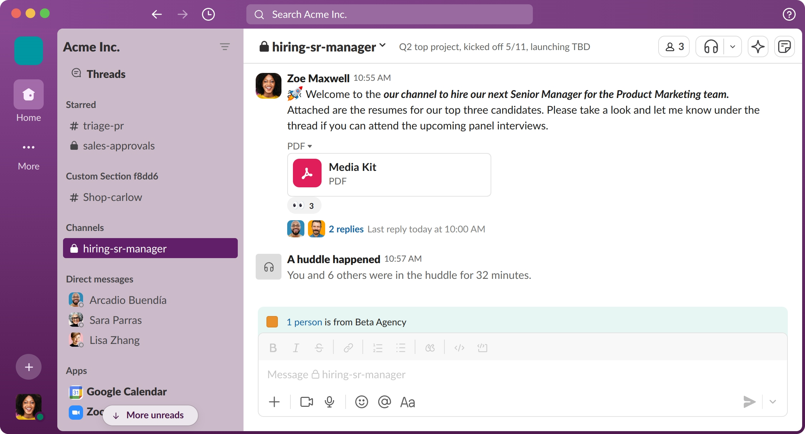

# Slack clone built with Next.js



## 📝 Table of contents

- [📝 Table of contents](#-table-of-contents)
- [📦 Installation](#-installation)
- [🚀 Getting started](#-getting-started)
- [📚 Documentation](#-documentation)
- [💻 Contributing](#-contributing)
- [📃 License](#-license)

## 📦 Installation

```bash
npm install
```

## 🚀 Getting started

Run the development server:

```bash
npm run dev


## 📦 Variables to set up
- Create a .env file in the root directory and add the following variables:
- All other variables are located in the Convex backend

```

CONVEX_DEPLOYMENT=.....
NEXT_PUBLIC_CONVEX_URL= .......

```

Open [http://localhost:3000](http://localhost:3000) with your browser to see the result.

You can start editing the page by modifying `pages/index.tsx`. The page auto-updates as you edit the file.

[API routes](https://nextjs.org/docs/api-routes/introduction) can be accessed on [http://localhost:3000/api/hello](http://localhost:3000/api/hello). This endpoint can be edited in `pages/api/hello.ts`.

The `pages/api` directory is mapped to `/api/*`. Files in this directory are treated as [API routes](https://nextjs.org/docs/api-routes/introduction) instead of React pages.

## 📚 Documentation

Documentation, Tutorials, and many more resources can be found on [Next.js Documentation](https://nextjs.org/docs).

## 💻 Contributing

Contributions are what make the open source community such an amazing place to learn, inspire, and create. Any contributions you make are **greatly appreciated**.

If you have a suggestion that would make this better, please fork the repo and create a pull request. You can also simply open an issue with the tag "enhancement".
Don't forget to give the project a star! Thanks again!

1. Fork the Project
2. Create your Feature Branch (`git checkout -b feature/AmazingFeature`)
3. Commit your Changes (`git commit -m 'Add some AmazingFeature'`)
4. Push to the Branch (`git push origin feature/AmazingFeature`)
5. Open a Pull Request

## 📃 License

Distributed under the MIT License. See `LICENSE` for more information.

```
